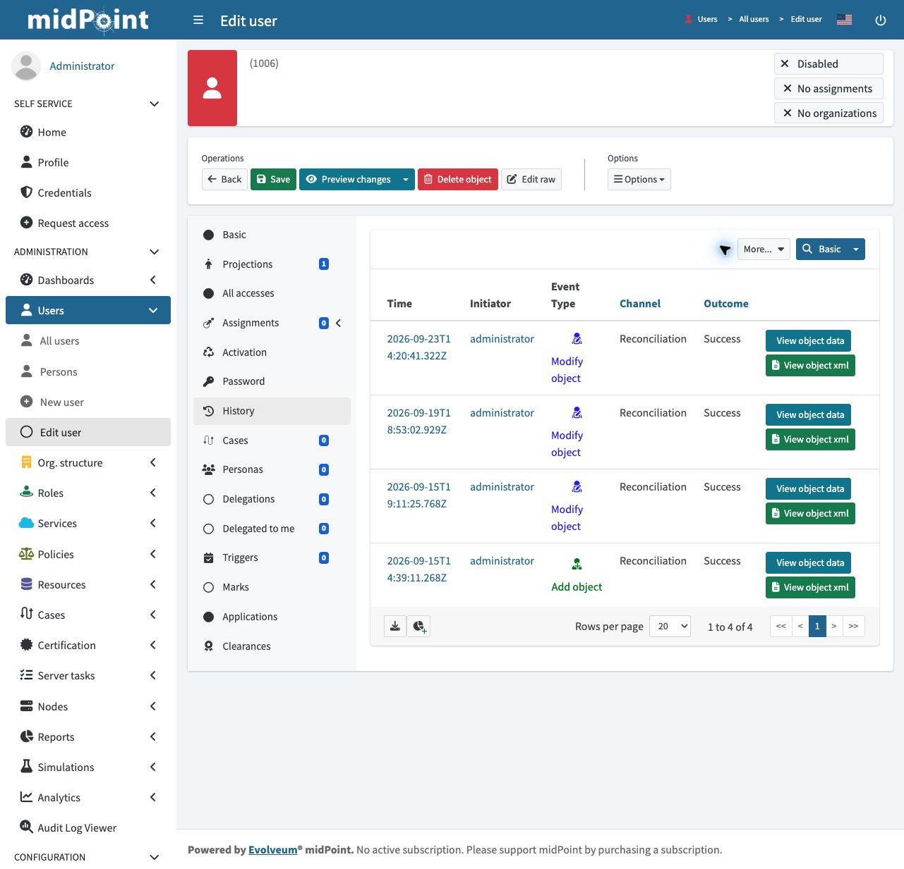

# IAM Implementation Portfolio

<!--
HOW TO USE THIS TEMPLATE
------------------------
This is your portfolio scaffold. The structure is already built for you.
Your job is to fill in each section with your own work as you go through the course.

1. Replace every [PLACEHOLDER] with your own details.
2. As you finish each part of the build, complete that capability's section below.
3. Drop your screenshots into /screenshots and your config files into /artifacts,
   then update the links.
4. Delete these HTML comment instructions once you have filled a section.

Do not try to fill it all at once. Complete a capability's section right after you
build it in the course, while it is fresh. That is how you end up with a portfolio
that actually reflects what you built and understand.

This portfolio is organized by CAPABILITY, not by course module. A recruiter or
interviewer should land here and immediately see what you can DO: onboard identities,
provision to targets, run the mover, certify access, federate with real protocols.
That framing is what turns a portfolio into interviews. You do not need every section
filled to start applying, build it up as you go, and lead with the capabilities you
are most confident explaining.
-->

**Name:** Kajeepan Sri Kanthan
**LinkedIn:** 
**GitHub:** github.com/srikanka
**Status:** In progress

---

## What This Portfolio Shows

I am building a local IAM lab and documenting verified results. My completed evidence covers HR-driven onboarding, OpenLDAP provisioning, and the joiner/leaver lifecycle using SimplifyHR and midPoint. The remaining sections are a learning roadmap; placeholder sections are not claims of completed implementations.

This repository documents my configuration, architectural decisions, and analysis for each capability I built. It is intended as portfolio evidence for IAM implementation and engineering roles.

<!-- Once you are further along, rewrite this in your own words and name the specific roles you are targeting. -->

---

## Environment

| Component | Purpose |
| --- | --- |
| midPoint | IGA platform: identity lifecycle, provisioning, reconciliation, access governance |
| SimplifyHR | HR source of truth: simulates an enterprise HRIS (Workday / SAP SuccessFactors equivalent) |
| OpenLDAP | Target directory: named user accounts provisioned here (Active Directory equivalent) |
| Auth0 | Access management and CIAM: OIDC, OAuth, and SAML federation |

---

## How This Repository Is Organized

- Each capability below has its own section: the problem it solves, what I built, the key concept, evidence, and a resume bullet.
- `/screenshots` holds the visual evidence for each capability.
- `/artifacts` holds the actual configuration I built: resource XML, Groovy mappings, role definitions. Screenshots show it happened; artifacts show how. Artifacts are your strongest evidence for a technical interviewer.

---

## Capabilities Built

**Foundations**
- [IAM Architecture and Stakeholder Mapping](#iam-architecture-and-stakeholder-mapping)

**Identity Governance (IGA)**
- [HR-Driven Onboarding and Directory Provisioning](#hr-driven-onboarding-and-directory-provisioning)
- [The Joiner and Leaver Lifecycle](#the-joiner-and-leaver-lifecycle)
- [Role-Based Access Control (RBAC)](#role-based-access-control-rbac)
- [The Mover Process](#the-mover-process)
- [Access Request and Approval Workflow](#access-request-and-approval-workflow)
- [Access Certification and the Governance Loop](#access-certification-and-the-governance-loop)

**Access Management and Federation (CIAM)**
- [OIDC: Single Sign-On to a Real Application](#oidc-single-sign-on-to-a-real-application)
- [OAuth: Delegated Access to a Real API](#oauth-delegated-access-to-a-real-api)
- [SAML: Enterprise SSO](#saml-enterprise-sso)
- [Consent, Custom Claims, and the JWT](#consent-custom-claims-and-the-jwt)

**Outcome**
- [My Transformation and Interview Readiness](#my-transformation-and-interview-readiness)

---

## IAM Architecture and Stakeholder Mapping

**The capability:** [Describe it. Example: before touching a tool, map the IAM architecture and understand what each stakeholder group needs, so requirements drive the design rather than the reverse.]

**What I did:**
[Describe the architecture you mapped: the source, the IGA platform, the target, and the access management layer. Note the stakeholder groups you identified and what each cared about.]

**Architecture diagram:**
```
[Draw your architecture as a simple text diagram, for example:]
SimplifyHR (source of truth)
      |  midPoint reads changes
      v
midPoint (IGA: lifecycle, RBAC, governance, audit)
      |  provisions accounts
      v
OpenLDAP (target directory)

Auth0 (access management: OIDC, OAuth, SAML) handles external and app federation
```

**Stakeholder mapping:**

| Stakeholder | What they care about | How I would speak to them |
| --- | --- | --- |
| HR | [fill in] | [fill in] |
| InfoSec | [fill in] | [fill in] |
| Application owners | [fill in] | [fill in] |
| Auditors | [fill in] | [fill in] |
| Business lead | [fill in] | [fill in] |

**The key concept I understood:**
[Example: IGA and access management are not the same layer. IGA answers who should have access and can we prove it; access management answers are you who you say you are and can you get in right now. Conflating them is a common scoping mistake.]

**Screenshots:**


**Enterprise equivalent:**
[SimplifyHR maps to Workday or SAP SuccessFactors; midPoint to SailPoint or Saviynt; OpenLDAP to Active Directory or Okta Universal Directory; Auth0 to Okta or Entra ID.]

**Resume bullet:**
> [Your line. Example: Mapped an end-to-end IAM architecture across IGA, access management, and directory layers, and translated stakeholder requirements into design decisions before implementation.]

---

## HR-Driven Onboarding and Directory Provisioning

I connected SimplifyHR to midPoint and OpenLDAP to turn employee records into managed identities and directory accounts. I configured inbound and outbound attribute mappings, employee-ID correlation, and an Employee role that supplies the OpenLDAP account requirement.

**Initial result, September 21, 2026:** seven simulated employees (`1001–1007`) had directory accounts under `ou=people`, all **LINKED** to their midPoint owners. The lifecycle section below documents the later new hire and termination.

```text
SimplifyHR → midPoint identity → Employee role → OpenLDAP account
```

**[View the initial provisioning workflow, screenshots, and troubleshooting](joiner-leaver/directory-provisioning.md).**

The evidence includes the live directory, linked OpenLDAP accounts, and earlier HR reconciliation results. The lab also exposed a role-scoping issue: its broad eligibility condition included the administrator. I document that limitation alongside the result. The subsequent [joiner and leaver validation](joiner-leaver/README.md) documents the completed lifecycle exercise.

**Resume bullet:**
> Built and validated an HR-driven onboarding workflow with midPoint and OpenLDAP, using attribute mappings and role-based provisioning to create and link directory accounts for seven simulated employees.

---

## The Joiner and Leaver Lifecycle

I validated HR-driven onboarding and offboarding across SimplifyHR, midPoint, and OpenLDAP. After adding John Wick (`1008`) and running reconciliation, his identity and directory account were provisioned. After terminating Oliver Bennett (`1006`) and reconciling, his midPoint identity was disabled and his LDAP account was absent from the active directory.

**Verified September 23, 2026:** seven active employee accounts remain in LDAP, alongside a separate administrator account. Oliver's HR record, disabled midPoint identity, and timestamped history are retained. The inactive OU is empty; this run supports account removal rather than an archived LDAP account.

**[View the complete lab, six screenshots, configuration artifacts, and findings](joiner-leaver/README.md).**



**Skills demonstrated:** source-to-target integration, inbound/outbound mappings, role-based provisioning, lifecycle verification, and audit evidence. HR changes and reconciliation were manually initiated; the configured processing automated the subsequent changes. Login denial and session revocation were not tested.

**Resume bullet:**
> Built and validated HR-driven joiner and leaver workflows in a local midPoint/OpenLDAP lab, automating directory account provisioning and removal through reconciliation while retaining identity records and timestamped audit history.

---

## Role-Based Access Control (RBAC)

**The capability:** [Describe it: access granted by role, not by hand, with roles assigned automatically where appropriate and requested where a human decision is needed.]

**What I built:**
[Your department roles with auto-assignment, and a manually requested role. Explain the two patterns.]

**The two RBAC patterns:**

| Pattern | Roles | Assigned when | Removed when |
| --- | --- | --- | --- |
| Auto-assigned | [e.g. Engineering_Employee, HR_Employee] | [condition true] | [condition false on next recompute] |
| Manually requested | [e.g. Contractor] | [request plus approval] | [explicit revocation or certification] |

**The key concept I understood:**
[Example: strong-strength auto-assign rules mean the HR source always wins. A department change automatically removes the old role and adds the new one, but manually granted access persists until reviewed.]

**Screenshots:**


**Artifacts:**
[Link your role definitions with autoassign blocks, for example artifacts/engineering-employee-role.xml and artifacts/hr-employee-role.xml]

**Enterprise equivalent:**
[Birthright roles and lifecycle event rules in SailPoint; Role Assignment Policy in Saviynt; Lifecycle Workflows in Entra ID Governance.]

**Resume bullet:**
> [Your line.]

---

## The Mover Process

**The capability:** [Describe it: when someone changes department, their old access is removed and their new access is granted, automatically.]

**What I built:**
[The department change in HR, the reconciliation, and the role delta that followed. Note what stayed (manually granted access) and what changed.]

**How it works:**
```
HR department change  ->  reconciliation  ->  auto-assign rules re-evaluate
  old department role removed, new department role added, manual roles stay
```

**The key concept I understood:**
[Example: the mover is riskier than the joiner because the person carries their history. Manually granted access does not disappear on a move; it persists until a review catches it. That is why certification exists.]

**Screenshots:**


**Artifacts:**
[Reference the same role artifacts; the strong-strength condition is what makes the mover work.]

**Enterprise equivalent:**
[Lifecycle event / mover workflow in SailPoint or Entra ID Governance.]

**Resume bullet:**
> [Your line.]

---

## Access Request and Approval Workflow

**The capability:** [Describe it: a user requests access they are not automatically entitled to, and it is granted only after approval.]

**What I built:**
[The self-service request for the manually requestable role, and the approval step that granted it.]

**The key concept I understood:**
[Example: not all access should be automatic. Elevated or sensitive access goes through request and approval, which creates human accountability and an audit record of who approved what.]

**Screenshots:**


**Artifacts:**
[Link the role that is requestable, if you exported it.]

**Enterprise equivalent:**
[Access request via the IGA self-service catalog with an approval workflow in SailPoint, often integrated with ServiceNow.]

**Resume bullet:**
> [Your line.]

---

## Access Certification and the Governance Loop

**The capability:** [Describe it: periodically, reviewers confirm or revoke the access people hold, catching what automated provisioning cannot reach.]

**What I built:**
[The certification campaign, the reviewer, the review decisions, and the automated remediation that removed revoked access.]

**How it works:**
```
Certification campaign  ->  reviewer certifies or revokes each item
  ->  automated remediation removes revoked access  ->  audit trail
```

**The key concept I understood:**
[Example: certification closes the governance loop. After a mover leaves stale access behind, certification is the mechanism that catches and removes it, with a timestamped record for audit.]

**Screenshots:**


**Artifacts:**
[Link the certification campaign definition if you exported it, for example artifacts/certification-campaign.xml]

**Compliance angle:**
[If you have a GRC or audit background, map events to controls, for example SOC 2 CC6.2 and CC6.3. If not, explain why certification matters for audit.]

**Resume bullet:**
> [Your line.]

---

## OIDC: Single Sign-On to a Real Application

**The capability:** [Describe it: a user logs into a third-party application using an identity held in your identity provider, without giving that app a password.]

**What I built:**
[Your Auth0 tenant connected to a real application via OIDC, and the login working end to end. Note where you inspected the token.]

**The key concept I understood:**
[Example: OIDC is about identity, who you are. The ID token is a signed statement from the identity provider that the application trusts, so the app never handles a password.]

**Screenshots:**


**Artifacts:**
[Link any relevant config, for example the OIDC application settings or a note of the endpoints used.]

**Enterprise equivalent:**
[The same pattern as Okta or Entra ID acting as the identity provider for a SaaS application.]

**Resume bullet:**
> [Your line.]

---

## OAuth: Delegated Access to a Real API

**The capability:** [Describe it: an application is granted permission to act on a user's behalf against an API, limited to exactly what the user consented to.]

**What I built:**
[The OAuth flow against a real API, the consent step, the token exchange, and the scope boundary you demonstrated.]

**The key concept I understood:**
[Example: OAuth is about authorization, what an app may do, not who you are. The token carries only the scopes consented to, so a compromised app can do only what it was granted and nothing more.]

**Screenshots:**


**Artifacts:**
[Link any relevant config or the request you constructed.]

**Enterprise equivalent:**
[Delegated API authorization, the same model behind every Sign in with and every third-party app permission grant.]

**Resume bullet:**
> [Your line.]

---

## SAML: Enterprise SSO

**The capability:** [Describe it: your identity provider federates a user into a real enterprise application using SAML, and you can read the assertion that flows between them.]

**What I built:**
[Auth0 as the identity provider for a real enterprise application via SAML, the trust setup with the signing certificate, and the login working. Note where you captured and read the assertion.]

**The key concept I understood:**
[Example: SAML establishes trust through a signed assertion. The service provider believes the assertion only because it is signed by a certificate it already trusts. The NameID identifies the user, and the attribute statement carries their attributes.]

**Screenshots:**


**Artifacts:**
[Link the SAML attribute mapping or relevant config if you exported it.]

**Enterprise equivalent:**
[Enterprise SSO into applications like Salesforce or Workday, still the dominant pattern for legacy and enterprise SaaS.]

**Resume bullet:**
> [Your line.]

---

## Consent, Custom Claims, and the JWT

**The capability:** [Describe it: controlling what user data reaches an application through the token, including consent flags, and understanding what stays out of the token.]

**What I built:**
[Your work with user_metadata and app_metadata in Auth0, the consent or terms-accepted flags, and any custom claim you surfaced into the token.]

**The key concept I understood:**
[Example: nothing from the user profile reaches the JWT unless you explicitly put it there. User-changeable data belongs in user_metadata; application decisions like consent flags belong in app_metadata; audit data can stay out of the token entirely.]

**Screenshots:**


**Artifacts:**
[Link the Auth0 Login Action script if you wrote one, for example artifacts/auth0-login-action.js]

**Enterprise equivalent:**
[Token customization and consent management in any CIAM platform, Auth0, Okta CIC, Ping, or Entra External ID.]

**Resume bullet:**
> [Your line.]

---

## My Transformation and Interview Readiness

**Where I started:** [Your background before this: your current role and skills. Be honest and specific.]

**Where I am now:** [What you can do now that you could not before. Update as you progress.]

**What I can demo in an interview:**
[List the capabilities you can open your laptop and show live, for example the full joiner and leaver lifecycle, the mover with role delta, a certification campaign, and OIDC or SAML login. This is your strongest closing line in any interview.]

**Roles I am targeting:** [List the roles you are aiming for.]
