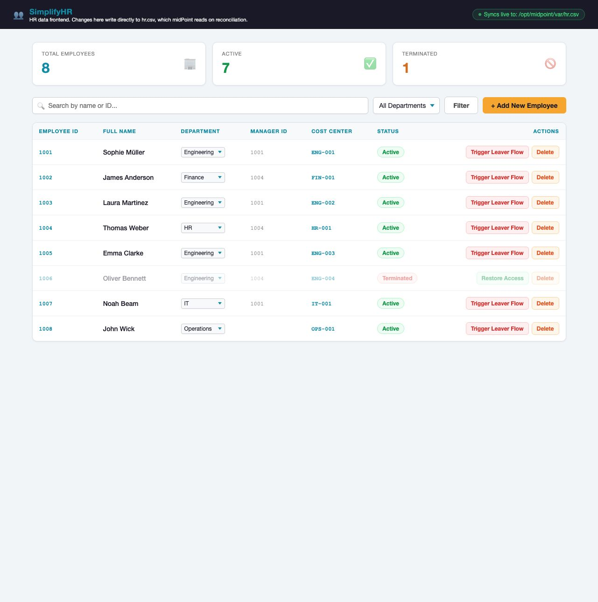
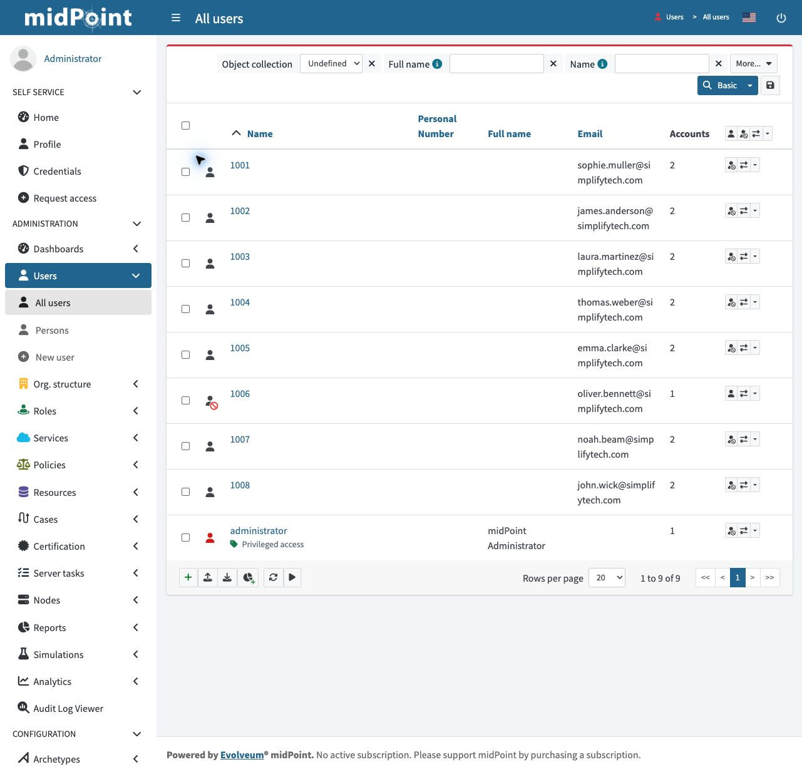
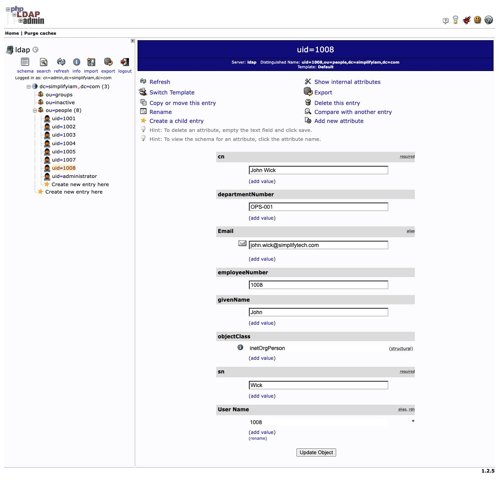
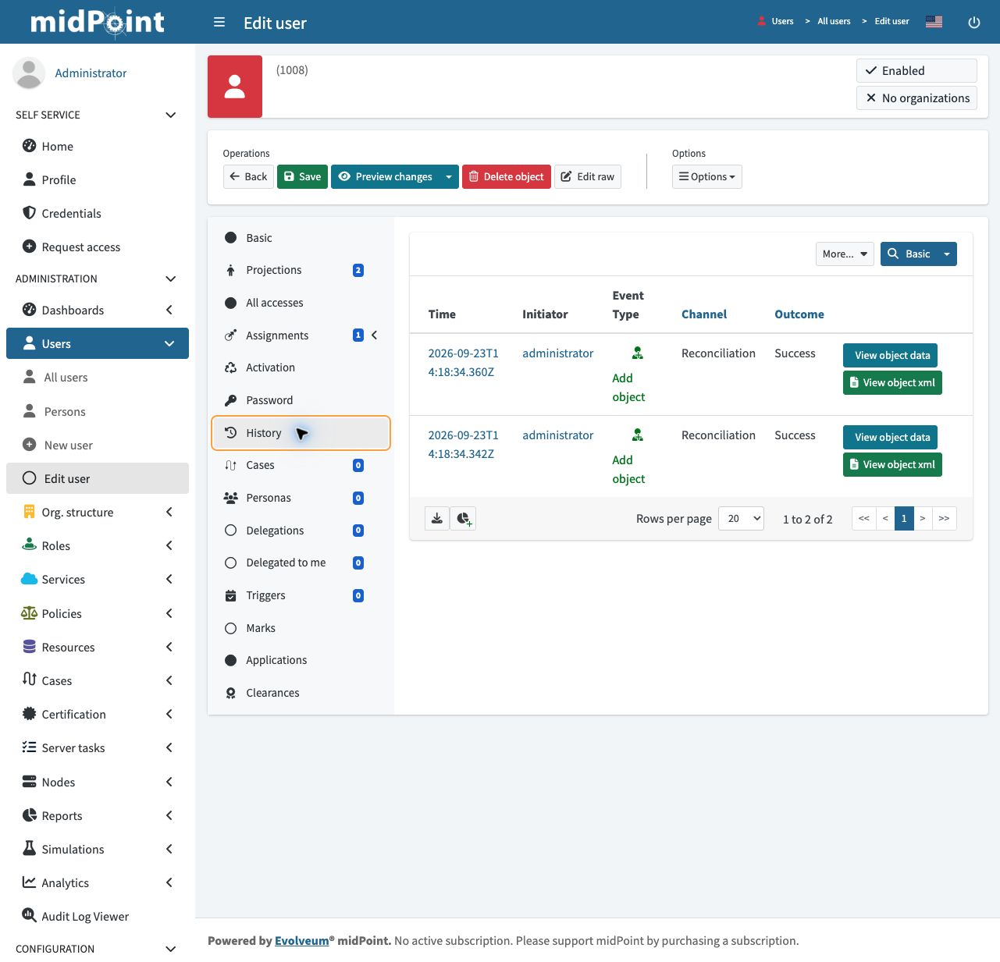
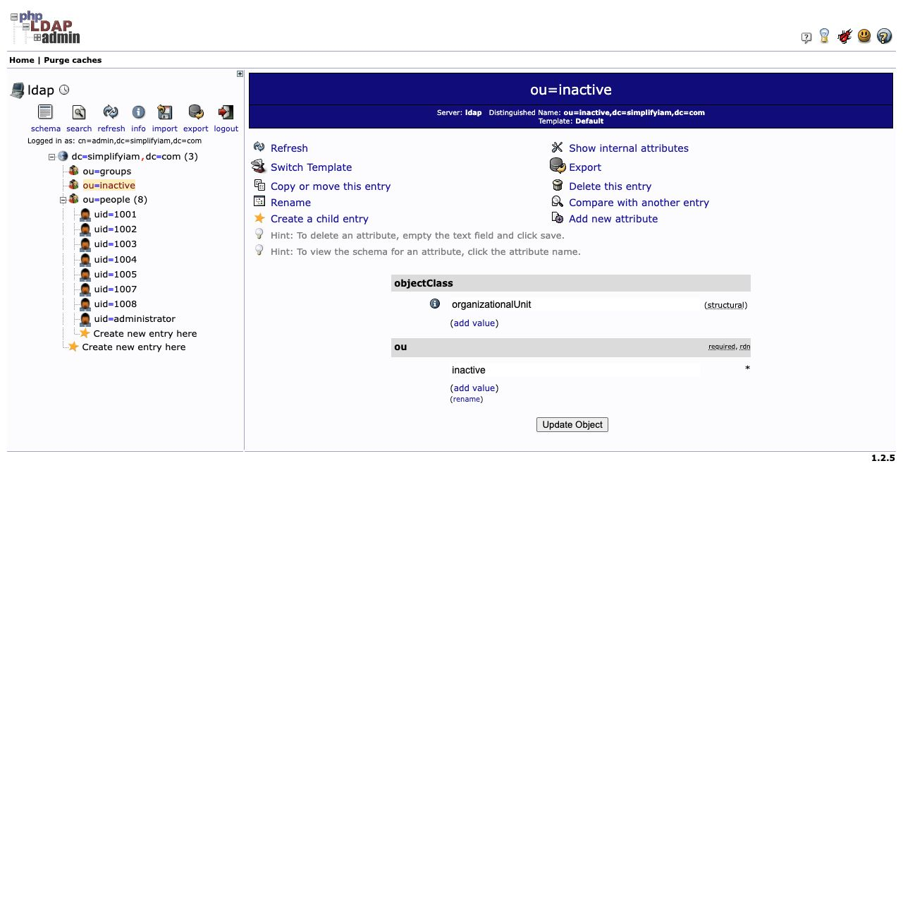

# HR-driven joiner and leaver lifecycle

I built and validated an identity lifecycle workflow using **SimplifyHR → midPoint → OpenLDAP**. A new hire receives a managed identity and directory account through configured rules. When HR marks an employee as terminated, reconciliation disables the central identity and reevaluates the directory account requirement.

**Verified on September 23, 2026:** John Wick (`1008`) has a provisioned LDAP account; Oliver Bennett (`1006`) is disabled in midPoint and absent from the active LDAP directory. Oliver's identity and timestamped midPoint history remain available.

This is a local Docker lab with simulated employees. I entered the HR changes and manually started reconciliation; midPoint handled the resulting identity and account changes. The evidence does not demonstrate a scheduled trigger or an authentication test.

## The problem this solves

New employees need consistent account provisioning. Departing employees need their access requirements removed promptly, with evidence of what happened. Handling these changes independently in every system creates opportunities for missing accounts, orphaned access, and incomplete records.

HR supplies employment facts, midPoint evaluates access policy, and OpenLDAP receives the resulting account changes.

```text
SimplifyHR                 midPoint                         OpenLDAP
New active employee  →     Create identity + apply role  →   Provision account
Terminated employee  →     Disable + reevaluate role    →   Remove account requirement
                           Retain identity and history      Apply target changes
```

## What I implemented

- Connected the HR source and matched records using employee ID.
- Configured inbound mappings, including HR status to midPoint activation status.
- Connected OpenLDAP and mapped names, email, employee number, cost center, and distinguished name (DN).
- Configured an Employee role whose inducement supplies the directory account requirement.
- Tested a new hire and a termination, then checked HR, midPoint, the directory, and audit history together.

[Earlier directory integration](directory-provisioning.md) documents the initial seven-employee provisioning result, resource-reference troubleshooting, and linked-account evidence. [HR onboarding notes](hr-onboarding-notes.md) cover the source integration.

## Test cases and observed results

| Case | HR input | midPoint result | Directory result |
| --- | --- | --- | --- |
| Joiner: John Wick, `1008` | New active employee, Operations | Enabled identity, one assignment, two projections/accounts; successful creation history | `uid=1008,ou=people,dc=simplifyiam,dc=com`, with mapped attributes |
| Leaver: Oliver Bennett, `1006` | Status changed to Terminated | Disabled identity retained, zero assignments, one remaining projection/account; successful modification history | `uid=1006` absent from `ou=people`; `ou=inactive` empty |

**Dataset context:** my earlier lab already contained Noah Beam as `1007`, so John became `1008`. After offboarding, HR contains eight employees: seven active and one terminated. LDAP's `ou=people` contains seven employee entries (`1001–1005`, `1007`, `1008`) plus the separate administrator account: eight entries total.

The administrator entry reflects the broad role eligibility condition identified in the earlier lab. It is not counted as an employee. Scoping that rule explicitly to eligible HR identities is a remaining hardening task.

## Evidence from the running lab

These screenshots show the state after the exercise. They are not reconstructed before-and-after images. The earlier integration screenshots provide the historical baseline.

### 1. HR is the source of employment status



Eight employee records remain in HR. John is Active; Oliver is Terminated. The leaver process preserves the source record.

### 2. midPoint reflects the lifecycle change



John (`1008`) has two connected account records. Oliver (`1006`) has the disabled indicator and one remaining account record. Account counts represent connected resource records, not successful logins. The full-name column is unpopulated in this lab; the configured given/family names and email identify the users.

### 3. The joiner exists in the target directory



John's account contains the expected DN, full name, email, employee number `1008`, and cost center `OPS-001`. The expanded directory tree shows the seven remaining employee accounts and the administrator, with no `uid=1006`.

### 4. Reconciliation recorded the joiner creation



John's History view contains successful **Add object** entries through the **Reconciliation** channel at approximately **2026-09-23 14:18:34 UTC**. Two displayed audit rows are not evidence of two separate user identities.

### 5. The leaver identity and history are retained


Oliver remains a disabled midPoint user with zero assignments. Removing the History view's default Time filter reveals four successful reconciliation events, from his creation on September 15 through the September 23 modification at **14:20:41.322 UTC** associated with this leaver run.

In this version, the equivalent per-user audit view for the lesson's “Records tab” is **Users → All users → 1006 → History**. A summary event demonstrates a recorded operation; it does not by itself detail every downstream action.

### 6. The observed result was removal, not an inactive-OU archive



The DN script can construct an address under `ou=inactive` when a user is disabled. Separately, the Employee role condition stops matching disabled users and can remove the account requirement. The final state—no Oliver under `ou=people`, an empty `ou=inactive`, and one remaining midPoint projection—supports LDAP account removal. It does **not** demonstrate a successful move to `ou=inactive`.

## What this demonstrates to an employer

- **Identity integration:** connecting an authoritative HR source, an IGA platform, and a target directory.
- **Policy-driven provisioning:** connecting role eligibility and account requirements to attribute mappings.
- **Lifecycle validation:** checking the source, central identity, target account, and audit record rather than relying only on a task completion message.
- **Troubleshooting and judgment:** distinguishing the configured DN routing from the actual combined role-policy outcome, and accounting for dataset differences.
- **Evidence-based documentation:** preserving screenshots, configuration excerpts, timestamps, and clear limits on the result.

## Configuration artifacts

- [HR resource configuration](artifacts/simplifyhr-resource.xml)
- [Inbound status mapping](artifacts/inbound-status-mapping.groovy)
- [Inbound email mapping](artifacts/inbound-email-mapping.groovy)
- [OpenLDAP outbound mappings](artifacts/openldap-outbound-mappings.xml)
- [DN routing script](artifacts/dn-routing.groovy)
- [Artifact scope and reuse notes](artifacts/README.md)

## Limits and next validation

The lab verifies provisioning, a disabled central identity, removal from the active directory, and retained midPoint history. It does not verify login denial, revocation of existing application sessions, all downstream applications, or compliance with a retention standard. Moving an account into another OU alone would not establish authentication denial.

For a production design, I would define and test the required target-specific disable/retain/delete behavior, restrict role eligibility to workforce identities, and verify authentication and session outcomes. The retained central audit history and the retention of the target account itself are separate concerns.

## Resume bullet

> Built and validated HR-driven joiner and leaver workflows in a local midPoint/OpenLDAP lab, automating directory account provisioning and removal through reconciliation while retaining identity records and timestamped audit history.

## Learning reference

Implemented in my own environment using [SimplifyIAM's Joiner and Leaver Live lesson](https://www.skool.com/simplify-iam-6792/classroom/dc510113?md=8793a705f7c24c198d01862ce0b97b8a). The screenshots document my simulated lab data and observed results; configuration scripts follow the course examples.
