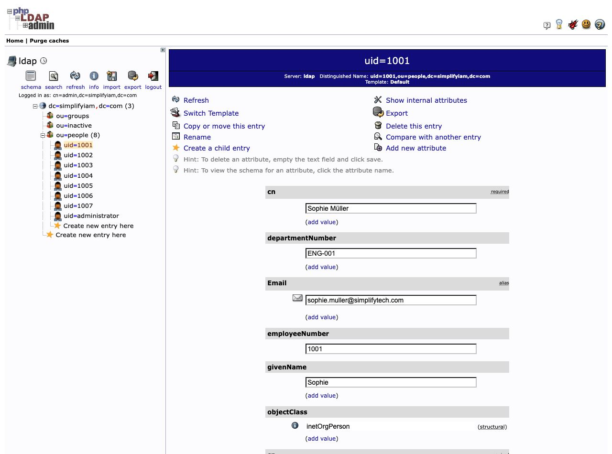
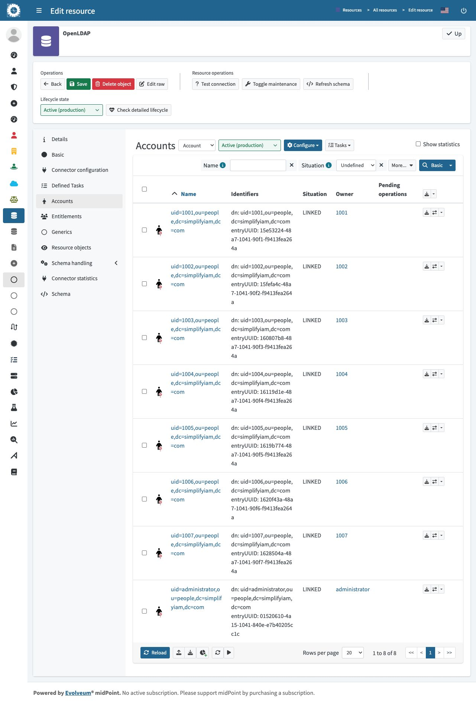

# HR-driven account provisioning

I built an onboarding workflow that turns an employee record in SimplifyHR into a managed identity in midPoint and an account in OpenLDAP. I configured the connections, attribute mappings, and Employee role, then ran HR reconciliation to apply the rules without manually creating each directory account.

**Result:** seven lab employees (`1001–1007`) have OpenLDAP accounts under `ou=people`, and all seven accounts show **LINKED** to their owners in midPoint. The screenshots below were captured on September 21, 2026.

## The problem this solves

When someone joins an organization, HR records their details, but IT still needs to create the right accounts. Manually copying that information takes time and can introduce mistakes. This lab demonstrates how an identity governance and administration (IGA) platform can use HR data and a role policy to make account creation consistent and repeatable.

```text
SimplifyHR                 midPoint                         OpenLDAP
Employee records    →      Managed user identity     →      Directory account
                           Employee role                    uid=1001,ou=people,...
     HR source             Access decisions                 Target directory
```

## How I built it

1. **Connected the HR source.** I imported employee details into midPoint and matched records using the employee ID, so existing identities could be updated instead of recreated.
2. **Connected the directory.** I configured OpenLDAP as a target resource and defined the account type midPoint should create.
3. **Mapped the account details.** I added seven outbound mappings for names, email, department, employee ID, and the account's directory address.
4. **Made account creation role-based.** I enabled role auto-assignment and configured the Employee role to supply an OpenLDAP account through an inducement.
5. **Verified the result.** After running SimplifyHR reconciliation, I checked the actual accounts in phpLDAPadmin and their ownership links in midPoint.

## Key concepts in plain language

**Outbound mappings** tell midPoint what information to write to the directory, such as copying a user's email into the LDAP `mail` attribute. **DN construction** builds the account's unique directory address, for example `uid=1001,ou=people,dc=simplifyiam,dc=com`. **Role-based account creation** means the Employee role carries the account requirement: when a user receives the role, midPoint has a reason to create their OpenLDAP account.

| Part | What it does in my lab |
| --- | --- |
| HR source | Supplies employee information |
| Correlation | Matches an HR record to the correct midPoint user using employee ID |
| Employee role | Defines who receives the directory account |
| Inducement | Connects the role to the OpenLDAP account requirement |
| Reconciliation | Reprocesses source records and applies the configured rules |
| LINKED status | Shows that midPoint knows which user owns an external account |

## Evidence

### Accounts exist in OpenLDAP



The directory contains employee accounts `1001–1007` under `ou=people`; opening `1001` shows the mapped name, department, email, and employee number.

### Accounts are linked to their owners



The OpenLDAP Accounts view shows all seven employee accounts as **LINKED**, with the matching midPoint user in the Owner column.

**What the extra account means:** the screenshots show eight accounts in total because `administrator` also received a directory account. The lab's auto-assignment condition checks whether a user is not disabled; it does not restrict membership to HR employees. This highlighted why role eligibility needs an explicit employee scope before using the rule in a real environment. The seven employee accounts are the onboarding result; the administrator is an additional lab account.

[Earlier HR onboarding evidence and mapping details](hr-onboarding-notes.md) show the imported identities, successful creation audit events, and linked HR records.

## Configuration artifacts

- [OpenLDAP outbound mapping configuration](artifacts/openldap-outbound-mappings.xml) — the seven mappings extracted from my running resource, with connection credentials excluded.
- [DN routing script](artifacts/dn-routing.groovy) — constructs the account's directory address from the user ID and status.
- [SimplifyHR resource configuration](artifacts/simplifyhr-resource.xml) — the earlier HR import configuration.
- [Artifact notes](artifacts/README.md) — explains what each file contains and how it fits into the lab.

## What I learned while troubleshooting

An identity in midPoint does not automatically mean an account exists in the directory. The role's inducement supplies that account requirement, and the outbound mappings supply its attributes.

I also investigated an inducement display error using the logs and raw XML. The resource reference contained a name filter but no resolved OID. Pointing it directly to OpenLDAP's resource OID established the reference. An OID identifies a midPoint object; it is separate from an employee ID such as `1001`.

## Scope and next step

This is a local Docker lab using simulated employees. It demonstrates the complete **joiner** path from HR to identity governance to directory provisioning. Account login and a completed leaver test are not demonstrated by these screenshots.

The DN script includes routing for disabled users to `ou=inactive`, while the role rule can also remove the account requirement when a user is disabled. My next validation is to test that combined leaver behavior and record the actual outcome.

## Resume summary

> Built and validated an HR-driven onboarding workflow with midPoint and OpenLDAP, using attribute mappings and role-based provisioning to create and link directory accounts for seven simulated employees.

## Learning reference

Implemented in my own lab using [SimplifyIAM's HR integration](https://www.skool.com/simplify-iam-6792/classroom/dc510113?md=fbceae818fe540599fe12e872d47f089) and [target directory integration](https://www.skool.com/simplify-iam-6792/classroom/dc510113?md=c89709aa49b549fcab263375883db63a) lessons. The configuration and screenshots document my working environment; the Groovy scripts follow the lesson examples.
