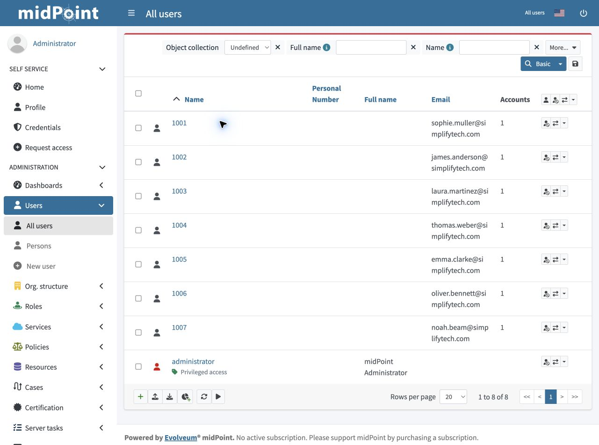
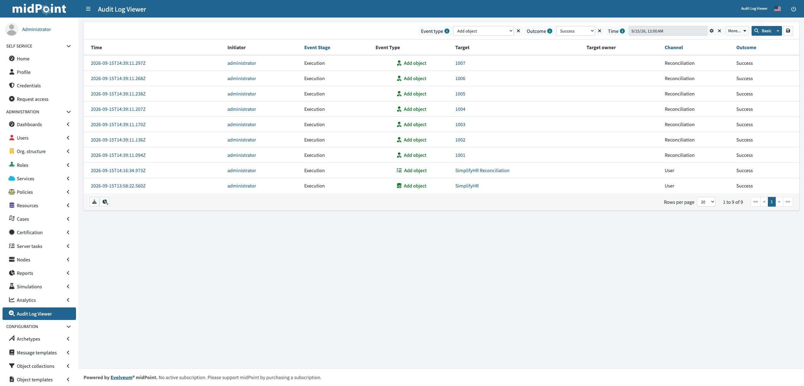
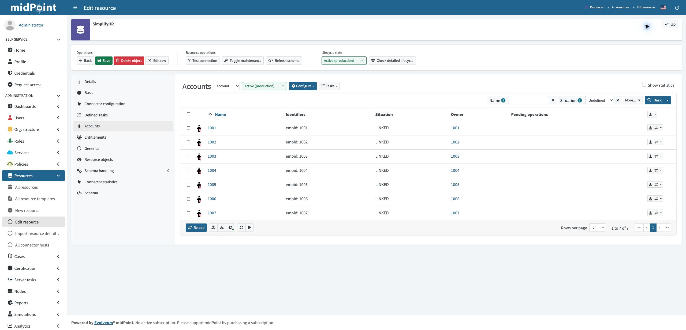

# HR onboarding: initial validation

Import workforce identities from an authoritative HR source into midPoint, with employee-ID correlation and an auditable reconciliation process.

## Use case

An organization needs employee identities created from HR records without manually re-entering each employee in its identity governance platform. This personal lab connects SimplifyHR's CSV source to midPoint and demonstrates the source-to-IGA stage of onboarding.

```text
SimplifyHR (hr.csv)
       |
       | CSV connector reads employee records
       v
midPoint: inbound mappings + employee-ID correlation
       |
       v
Workforce identities + linked HR accounts + audit records
```

Inbound mappings translate source attributes into identity properties, such as first name, department, and activation status. Correlation matches the HR employee ID to midPoint's `name` so existing identities can be linked and synchronized rather than recreated. Provisioning to a directory is a subsequent stage: creating an identity in midPoint alone does not create a directory account.

## Configuration

| HR attribute | midPoint target | Transformation |
| --- | --- | --- |
| `empid` | `name` | As is |
| `firstname` and `lastname` | `emailAddress` | Groovy normalizes names and constructs a lowercase email address |
| `firstname` | `givenName` | As is |
| `lastname` | `familyName` | As is |
| `department` | `organizationalUnit` | As is |
| `costcenter` | `costCenter` | As is |
| `status` | `activation/administrativeStatus` | Groovy maps `Active` to `ENABLED`, other values to `DISABLED` |

- Connector: `CsvConnector` v2.9; CSV path: `/opt/midpoint/var/import/hr.csv`.
- Account name and unique identifier: `empid`.
- Correlation: `name`, populated from the employee ID.
- Reactions: **Linked → Synchronize**, **Unlinked → Link**, **Unmatched → Add focus**.
- The Delete capability is disabled to protect HR rows from connector deletion. This setting alone does not disable every other write capability.

## Evidence — September 15, 2026

### Imported identities



The Users list contains identities **1001–1007**, alongside the built-in administrator. Each employee has one linked account and a populated email address. Full name and Personal Number are not mapped in this configuration; first and last names are stored separately as givenName and familyName.

### Automatic creation audit trail



The audit view is filtered from September 15, 2026, with **Event type: Add object** and **Outcome: Success**. Seven execution events in the **Reconciliation** channel show creation of identities 1001–1007 at approximately **14:39:11 UTC**. The two earlier rows record creation of the resource and reconciliation task.

### HR account links



SimplifyHR's Accounts view shows **LINKED** for all seven records, with an owner for each account.

## Configuration artifacts

- [SimplifyHR resource XML](artifacts/simplifyhr-resource.xml)
- [Email expression](artifacts/inbound-email-mapping.groovy)
- [Status expression](artifacts/inbound-status-mapping.groovy)
- [Artifact notes](artifacts/README.md)

## Troubleshooting lesson

The activation import initially failed with `Expected boolean type ... ActivationStatusType ... condition in mapping 'Status'`. The status-conversion script had been duplicated in both **Expression** and **Condition**. Removing the duplicate condition allowed reconciliation to create the identities.

While preparing the evidence, the Email mapping also had its transformation duplicated in Condition. A mapping expression produces the target value; a condition must produce a Boolean. The corrected configuration keeps each transformation only in Expression. A subsequent reconciliation populated email addresses for all seven existing users without creating additional identities.

## Scope at the time of this validation

This folder currently documents HR-to-midPoint onboarding. Directory provisioning and a live leaver demonstration will be added as those capabilities are implemented. The source lesson describes six employees; this lab has seven.

## Resume bullet

> Configured a CSV-based HR source connector in midPoint with inbound attribute mappings, Groovy transformations, and correlation rules to import and deduplicate workforce identities.

## Learning source

Built while following [SimplifyIAM — L3: Connecting SimplifyHR](https://www.skool.com/simplify-iam-6792/classroom/dc510113?md=fbceae818fe540599fe12e872d47f089). Screenshots show my local lab; the Groovy expressions follow the lesson's examples.
